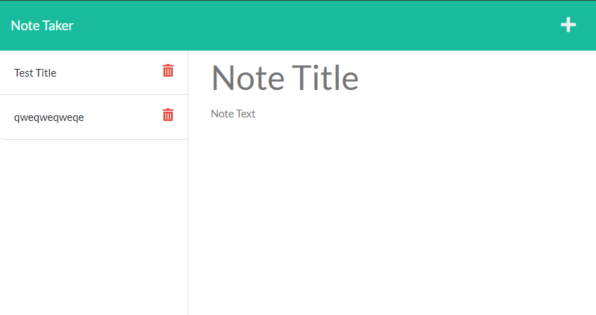

# E-Commerce Back End

This project is a Heroku-deployed website that allows the user to take notes to be saved and deleted. I created the server.js and routes.js files in order to handle user requests.

## Authors

- [Dylan Freeman](https://www.github.com/templarmanatee)

## Badges

## Deployment

https://remarque-lite.herokuapp.com/

## Screenshots

## License

[MIT](https://choosealicense.com/licenses/mit/)

## Feedback

If you have any feedback, please reach out to me at dylan@dylanfreeman.tech
